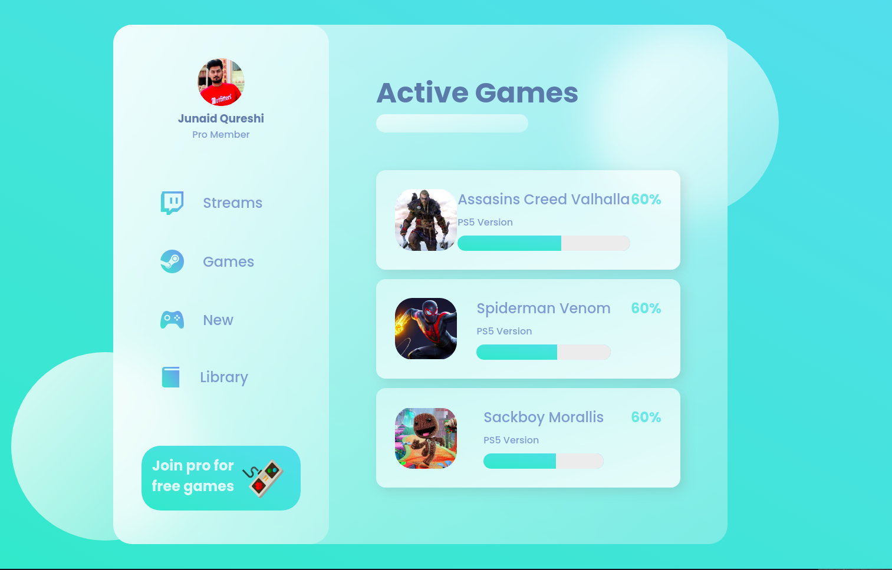

# Glass Website

# HOMEPAGE

## Run Locally

- Run this command `git clone https://github.com/developer-junaid/Glass-Website-CSS.git`
- You are now in the dev environment and you can play around

## Tech Stack

- HTML5
- CSS3
